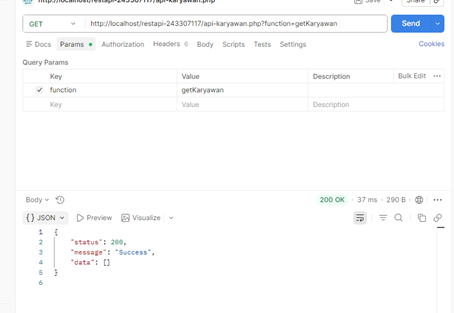
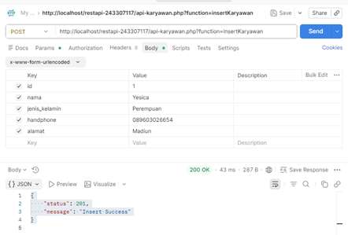
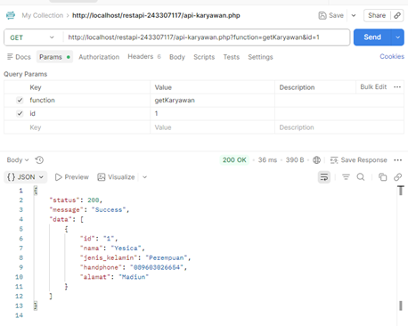
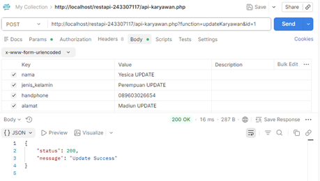
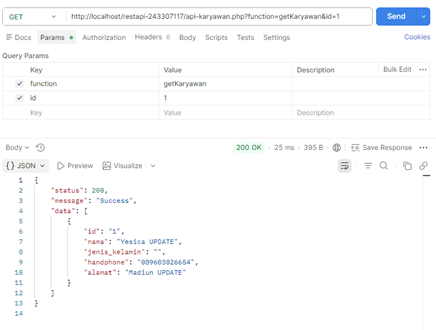
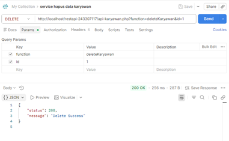
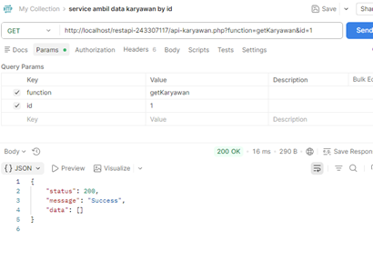

# Tugas Praktikum REST API - CRUD Karyawan

**Nama:** Yesica Frestysia Anisa Putri Arthaza
**NIM:** 243307117
**Kelas/Prodi:** 4D / Teknologi Informasi
**Dosen:** Angger Binuko Paksi, M.Kom.

## Screenshot Hasil Praktikum 

### 1. Ambil Semua Data Karyawan

### 2. Tambah Data Karyawan

### 3. Ambil Data Berdasarkan ID

### 4. Update Data Karyawan

### 5. Cek Hasil Update (Get All)

### 6. Hapus Data Karyawan (Delete)

### 7. Cek Hasil Akhir Setelah Hapus

## File Project
- `api-karyawan.php`: Script utama API.
- `connection.php`: Koneksi database.
- `db_cloudpnm.sql`: File database (SQL).
